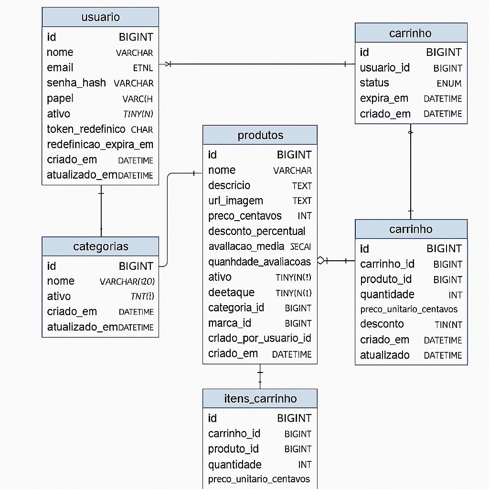

# 📦 Banco de Dados - Loja Online

## 🔗 Relacionamentos Principais

- **Usuário ↔ Produtos**: cada produto é cadastrado por um usuário.  
- **Categorias ↔ Produtos**: cada produto pertence a uma categoria.  
- **Marcas ↔ Produtos**: cada produto pertence a uma marca.  
- **Usuário ↔ Carrinho**: cada usuário tem no máximo 1 carrinho aberto.  
- **Carrinho ↔ Itens_Carrinho ↔ Produtos**: um carrinho pode ter vários produtos, e cada produto pode aparecer em vários carrinhos.  

---

## 📝 Observações

- Preços são armazenados em **centavos** para evitar problemas com arredondamento.  
- Os **CHECK CONSTRAINTS** garantem integridade (ex: quantidade > 0, descontos entre 0 e 90).  
- **Índices** foram criados para melhorar a performance de buscas frequentes.  

---

## 🖼️ Diagrama do Banco de Dados

